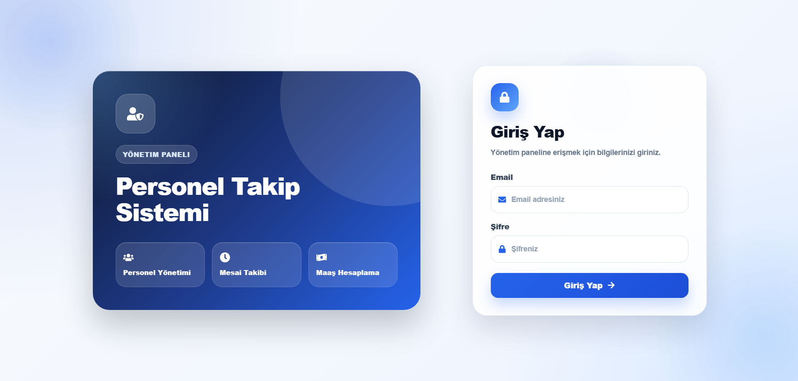

# PTS UI - Personel Takip Sistemi Frontend

Bu repository, Personel Takip Sistemi projesinin frontend tarafını içermektedir. Uygulama React ve Vite kullanılarak geliştirilmiştir. Backend tarafındaki REST API servisleriyle Axios üzerinden iletişim kurmaktadır.

Backend repository: `pts-api`

## Proje Hakkında

PTS UI; birim, personel, mesai ve maaş yönetimi işlemlerinin kullanıcı arayüzünü sağlar. Kullanıcı sisteme giriş yaptıktan sonra ilgili yönetim sayfalarından kayıt ekleme, güncelleme, silme ve listeleme işlemlerini gerçekleştirebilir.

## Kullanılan Teknolojiler

* React
* Vite
* Axios
* React Router DOM
* React Icons
* CSS
* Git
* GitHub

## Özellikler

* Kullanıcı giriş ekranı
* Birim yönetimi
* Personel yönetimi
* Mesai yönetimi
* Maaş yönetimi
* Döneme göre maaş listeleme
* Personel dönem özeti görüntüleme
* Başarılı işlemler için toast bildirimleri
* Hatalı işlemler için özel uyarı popup sistemi
* Silme işlemleri için onay popup sistemi
* Premium panel tasarımı
* Modern navbar tasarımı
* Responsive kullanıcı arayüzü
* 404 Not Found sayfası

## Proje Yapısı

```text
pts-ui
├── src
│   ├── api
│   ├── components
│   ├── css
│   ├── pages
│   ├── App.jsx
│   └── main.jsx
│
├── package.json
└── README.md
```

## Kurulum

Repoyu klonlayın:

```bash
git clone https://github.com/kullanici-adi/pts-ui.git
```

Proje klasörüne gidin:

```bash
cd pts-ui
```

Bağımlılıkları yükleyin:

```bash
npm install
```

Projeyi çalıştırın:

```bash
npm run dev
```

Frontend varsayılan olarak şu adreste çalışır:

```text
http://localhost:5173
```

## Backend Bağlantısı

Frontend uygulaması backend API ile iletişim kurmak için Axios kullanır.

Backend varsayılan adresi:

```text
http://localhost:8080
```

Axios yapılandırması genellikle şu dosyada bulunur:

```text
src/api/axiosInstance.js
```

Örnek yapı:

```javascript
import axios from "axios";

const api = axios.create({
    baseURL: "http://localhost:8080",
});

export default api;
```

## Sayfalar

* Login Page
* Birim Yönetimi
* Personel Yönetimi
* Mesai Yönetimi
* Maaş Yönetimi
* Not Found Page

## Ekran Görüntüleri

Ekran görüntüleri `screenshots` klasörü altında tutulabilir.

```text
screenshots
├── login.png
├── birim-page.png
├── personel-page.png
├── mesai-page.png
├── maas-page.png
└── not-found-page.png
```

### Giriş Sayfası



### Birim Yönetimi


### Personel Yönetimi


### Mesai Yönetimi


### Maaş Yönetimi


## Geliştirilebilecek Özellikler

* Dashboard sayfası
* Arama ve filtreleme
* Dark mode
* Grafiklerle raporlama
* Skeleton loading ekranı
* Detay paneli
* Gelişmiş bildirim sistemi
* Mobil görünüm geliştirmeleri

## Geliştirici

Servet Demir

Bu frontend projesi, staj sürecinde React, Vite, Axios, component yapısı, sayfa yönlendirme ve modern arayüz geliştirme konularını uygulamalı olarak pekiştirmek amacıyla hazırlanmıştır.
