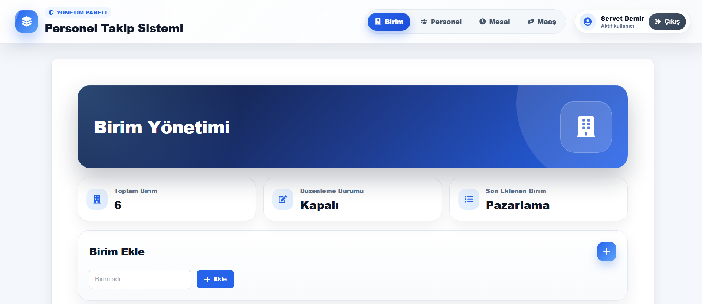
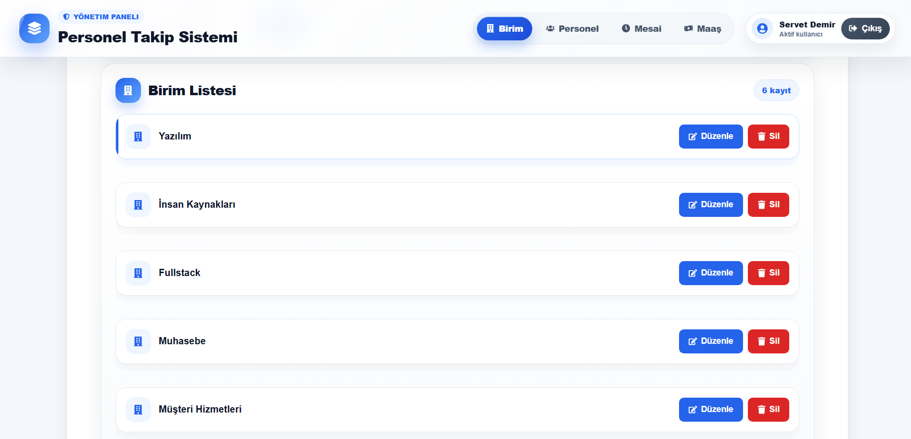
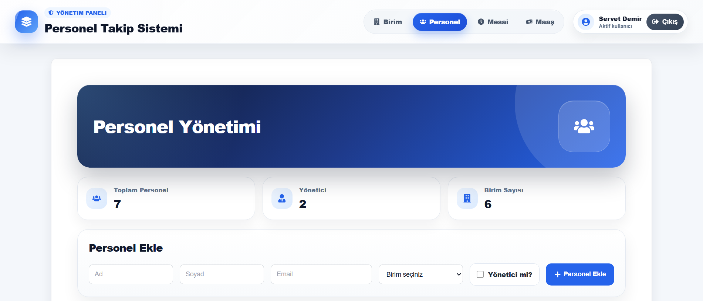
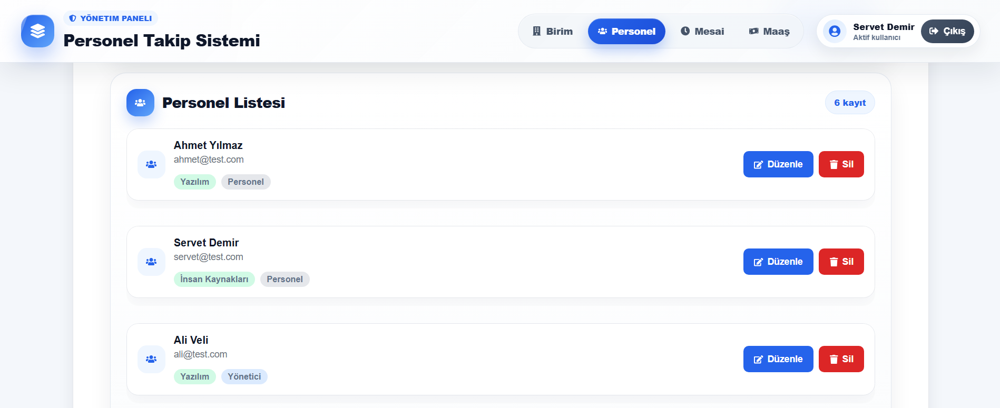
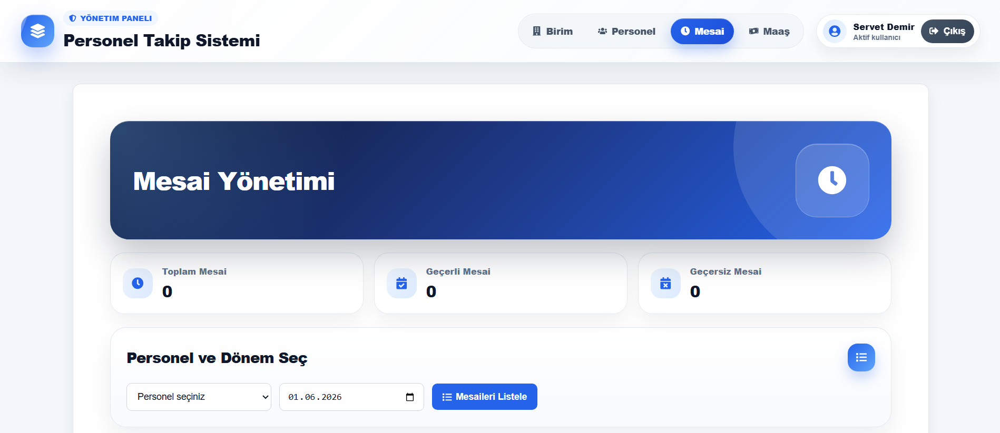
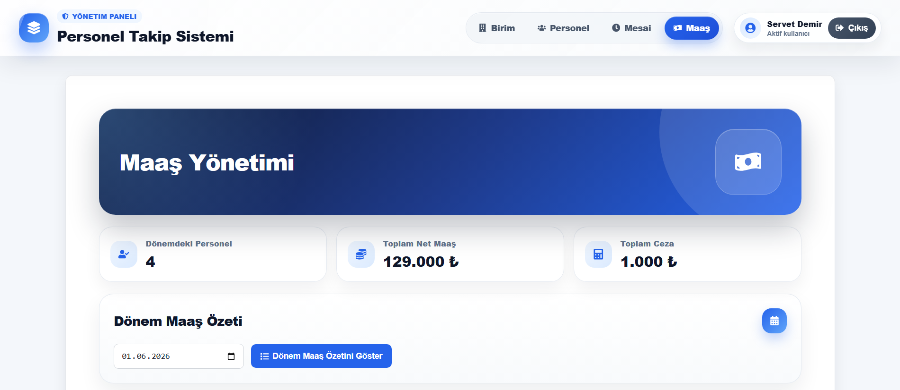

# PTS UI - Personel Takip Sistemi Frontend

Bu repository, Personel Takip Sistemi projesinin frontend tarafını içermektedir. Uygulama React ve Vite kullanılarak geliştirilmiştir. Backend tarafındaki REST API servisleriyle Axios üzerinden iletişim kurmaktadır.

Backend repository: [PTS-api](https://github.com/Servet-Demir/PTS-api)

## Proje Hakkında

PTS UI; birim, personel, mesai ve maaş yönetimi işlemlerinin kullanıcı arayüzünü sağlar. Kullanıcı sisteme giriş yaptıktan sonra ilgili yönetim sayfalarından kayıt ekleme, güncelleme, silme ve listeleme işlemlerini gerçekleştirebilir.

Uygulamada modern bir yönetim paneli görünümü, premium kart tasarımları, özel popup yapıları ve başarılı işlemler için toast bildirimleri kullanılmıştır.

## Kullanılan Teknolojiler

* React
* Vite
* Axios
* React Router DOM
* React Icons
* CSS
* Git
* GitHub

## Özellikler

* Kullanıcı giriş ekranı
* Modern ve responsive navbar
* Birim yönetimi
* Personel yönetimi
* Mesai yönetimi
* Maaş yönetimi
* Dönem bazlı maaş özeti görüntüleme
* Personel dönem özeti görüntüleme
* Başarılı işlemler için toast bildirimleri
* Hatalı işlemler için özel uyarı popup sistemi
* Silme işlemleri için onay popup sistemi
* Premium panel ve kart tasarımları
* Modern login sayfası
* Responsive kullanıcı arayüzü
* 404 Not Found sayfası

## Proje Yapısı

```text
PTS-ui
├── public
├── screenshots
├── src
│   ├── api
│   ├── components
│   ├── css
│   ├── pages
│   ├── App.jsx
│   └── main.jsx
│
├── .gitignore
├── eslint.config.js
├── index.html
├── package-lock.json
├── package.json
├── vite.config.js
└── README.md
```

## Kurulum

Repoyu klonlayın:

```bash
git clone https://github.com/Servet-Demir/PTS-ui.git
```

Proje klasörüne gidin:

```bash
cd PTS-ui
```

Bağımlılıkları yükleyin:

```bash
npm install
```

Projeyi çalıştırın:

```bash
npm run dev
```

Frontend varsayılan olarak şu adreste çalışır:

```text
http://localhost:5173
```

## Backend Bağlantısı

Frontend uygulaması backend API ile iletişim kurmak için Axios kullanır.

Backend varsayılan adresi:

```text
http://localhost:8080
```

Axios yapılandırması şu dosyada bulunur:

```text
src/api/axiosInstance.js
```

Örnek yapı:

```javascript
import axios from "axios";

const api = axios.create({
    baseURL: "http://localhost:8080",
});

export default api;
```

## Sayfalar

* Login Page
* Birim Yönetimi
* Personel Yönetimi
* Mesai Yönetimi
* Maaş Yönetimi
* Not Found Page

## Maaş Yönetimi Mantığı

Maaş sayfasında kullanıcı bir dönem seçerek o dönemde mesai kaydı bulunan personellerin maaş özetini görüntüleyebilir.

Maaş özeti kartlarında şu bilgiler gösterilir:

* Personel adı ve soyadı
* Personelin rolü
* Dönem bilgisi
* Toplam mesai kaydı
* Geçersiz gün sayısı
* Brüt maaş
* Ceza
* Net maaş

Bu sayede seçilen döneme ait maaş durumu tek ekranda özetlenebilir.

## Ekran Görüntüleri

Ekran görüntüleri `screenshots` klasörü altında tutulmaktadır.

```text
screenshots
├── login.png
├── birim-overview.png
├── birim-list.png
├── personel-overview.png
├── personel-list.png
├── mesai-overview.png
├── maas-overview.png
└── not-found-page.png
```

### Giriş Sayfası


### Birim Yönetimi





### Personel Yönetimi





### Mesai Yönetimi



### Maaş Yönetimi



### 404 Sayfası


## Geliştirilebilecek Özellikler

* Dashboard sayfası
* Arama ve filtreleme
* Dark mode
* Grafiklerle raporlama
* Skeleton loading ekranı
* Detay paneli
* Gelişmiş bildirim sistemi
* Mobil görünüm geliştirmeleri
* Excel veya PDF çıktı alma
* Birim bazlı personel ve maaş raporları

## Geliştirici

Servet Demir

Bu frontend projesi, staj sürecinde React, Vite, Axios, component yapısı, sayfa yönlendirme ve modern arayüz geliştirme konularını uygulamalı olarak pekiştirmek amacıyla hazırlanmıştır.
